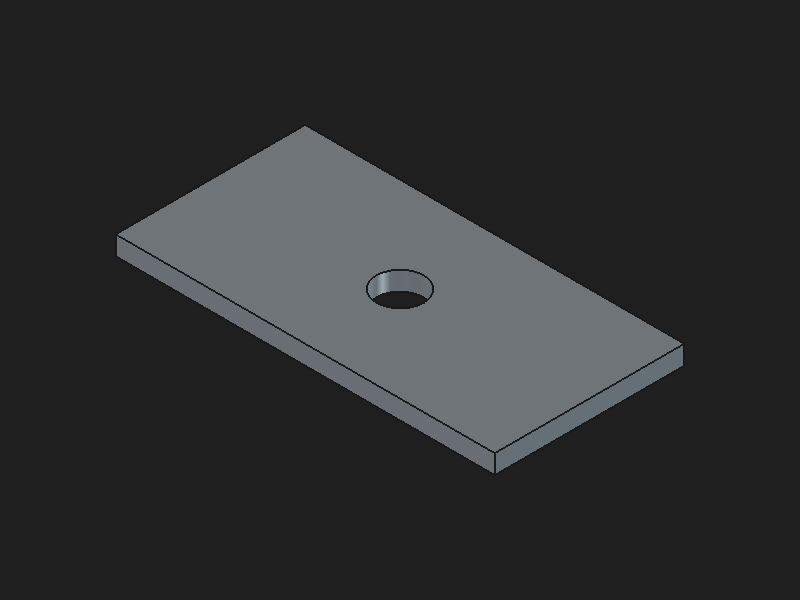

# Verification record — 2026-09-07

This is an experimental first release, with explicit separation between local/software evidence and physical printer evidence.

| Stage | Evidence | Result |
| --- | --- | --- |
| Python package | Python 3.12, uv locked environment; wheel and sdist build | Passed locally on macOS ARM64 |
| MCP | Actual stdio initialization, tool list, capabilities call and blocked unapproved start | Passed; 12 tools |
| Offline behavior | CAD/preflight fixtures, FTPS/MQTT behavior, review, stale/busy/mismatched state, restart/no duplicate start, cross-job lease and completion attribution | Test suite in `tests/`; run `uv run --frozen pytest -q` |
| FreeCAD | 1.1.3 app + pinned FreeCADMCP addon; bundled plate script, named-solid validation and source-preserving export | FCStd/STL/STEP produced; CAD bounds 80 × 40 × 4 mm, volume 12485.840734641019 mm³ |
| Bambu Studio | 2.8.2 GUI; imported exported STL, Slice/Preview, first-layer inspection, plate export | A1 / 0.4 mm / Textured PEI Plate / Generic PLA; 20 layers; 20m59s; 8.37 g shown in GUI |
| Custom preflight | Immutable snapshot of that GUI export | Passed; single plate, project slot 0; first-layer nozzle 220°C, bed profile 65°C |
| CLI presets | Raw project-settings dump and ad-hoc converted profiles | Correctly rejected by Studio preset validation; CAD retained for GUI continuation. Full CLI presets require separate local validation. |
| Printer connection | No LAN host/serial/access code supplied for this verification run | Not verified |
| FTPS upload / MQTT start / actual output | No physical print job sent | **Not verified**; do not infer it from mocked tests |
| Other platforms/models/firmware | CI checks Python behavior on macOS/Linux/Windows; no apps/printers in CI | Not hardware compatibility certification |

Sliced verification artifact SHA256: `902925105b13f43493dd1d0ebd438b997832750bff7699e70d27b2e7a0e95952`.
The generated CAD/slice and local printer configuration are not committed. The sample is reproducible from `examples/plate.py`; slicer metadata timestamps make archive hashes run-specific.

Before using the LAN transport, perform an operator-supervised test on your own model/firmware and authorized LAN configuration. Keep Bambu Studio and the printer's physical controls available. A software `accepted` result is not `RUNNING`; a matching `FINISH` counts as verified completion only after this job's `RUNNING` was observed. No remote protocol can guarantee exactly-once physical execution; the package guarantees that its own automatic workflow does not repeat the dispatch for a job after an attempted send.
